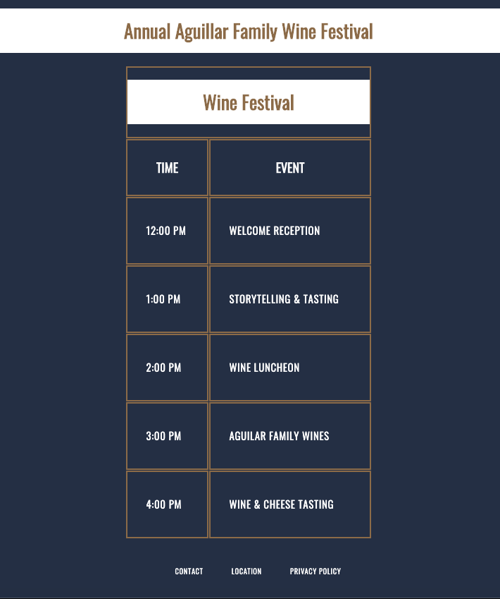

# Wine-Festival-Schedule

### **Description:**
This is a project that allowed me to gain some practice at creating HTML tables, including rows and columns. The page also includes a header and footer. The table displays a schedule of events in an organized and easy to read fashion. The event is for a fictional wine festival owned by a fictional family vineyard.  
 

_____

### **Instructions for Viewing the Page**
* This webpage simply needs to be opened in any browser in order to be viewed. 
 
_____

### **Demo Screenshots**
##### Wine Festival Schedule
* The events are displayed in a nice, orderly fashion!

 
_________

### **Technologies Used**
* HTML5
* HTML Tables
* CSS
 
_____

### **Built With**
* Visual Studio Code

